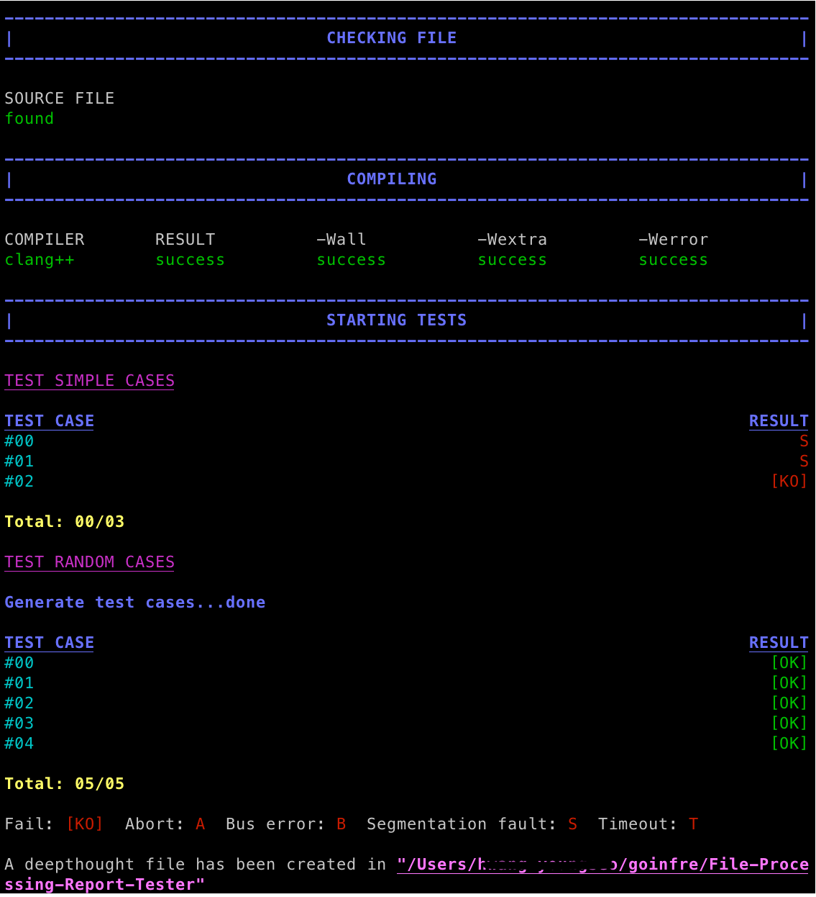

# File Processing Report Tester (ver 2024)

This repository contains scripts to test the KMU File Processing report.

</br>



<div>
	<strong>Source must written in </strong>
	<code>C/C++ language</code> 
	<strong>and the file name must be </strong>
	<code>main.c</code> 
	<strong>or </strong>
	<code>main.cpp</code>
	</br>
	</br>
	<p>The script will do following tests:</p>
	<ul>
		<li>
			Check if the source file exists
			</br>
			⚠️ If there is no source file, you will <strong>get 0 point</strong>
		</li>
		<li>
			Check compilation of the source file
			</br>
			⚠️ If there is an error with the compilation, you will <strong>get 0 point</strong>
		</li>
		<li>[Recommended] Compile with the following options</li>
	    <ul>
	    	<li><code>-Wall</code></li>
	    	<li><code>-Wextra</code></li>
	    	<li><code>-Werror</code></li>
		</ul>
		<li>Test the output of the program</li>
	</ul>
	<p>At the end of the test, a <code>deepthought</code>file will be generated, inside which you can find all the result and error/failure messages.</p>
	<p>❗️ Result of the test is not your final grade ❗️</p>
</div>

</br>
</br>
</br>

# Getting Started

## Installation

```
git clone https://github.com/younganswer/File-Processing-Report-Tester.git
```

</br>

## Configuration

If you run the script for the first time, it will automatically create `my_config.sh` file and ask you to edit it with the path of your project. You can also choose the colors that will be used and the path where the deepthought file will be created.

</br>

## Test cases

You can add your own test cases in the [testcase](testcase) directory. The script will run all the test cases in the directory.

</br>
</br>

# Running script

Go to the directory where you cloned and run the script

```
bash grademe.sh
```

</br>
</br>

or run with the absolute path

```
bash /path/where/you/cloned/grademe.sh
```

</br>
</br>
</br>

# License

This project is licensed under the MIT License - see the [LICENSE](LICENSE) file for details.

</br>
</br>

# Contact

If you have any questions, feel free to contact me at <mailto:younganswer@kookmin.ac.kr>

</br>

Any attribution is appreciated.
